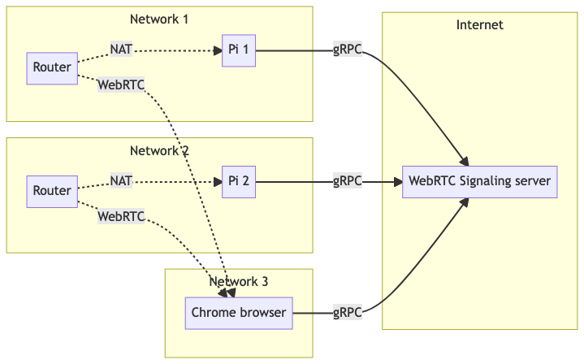

A web-based video call room for 02 Pi devices installed camera, micro and speaker. It's like [Google Meet Hardware](https://workspace.google.com/products/meet-hardware/) but much more simpler

# How it runs



The above diagram is generated from below snippet on [Mermaid Live Editor](https://mermaid.live/)

```
flowchart LR
    subgraph z1 [Internet]
        s[WebRTC Signaling server]
    end
    subgraph z2 [Network 1]
        r1[Router]-. NAT.->p1[Pi 1]
        p1[Pi 1]-- gRPC -->s
    end
    subgraph z3 [Network 2]
        r2[Router]-. NAT.->p2[Pi 2]
        p2-- gRPC -->s
    end
    subgraph z4 [Network 3]
        r1-. WebRTC .->b[Chrome browser]
        b-- gRPC -->s
        r2-. WebRTC  .->b
    end
```

# The repo structure

- `apps`: consult README file on each folder
  * `pi-camera-client` app: a Python app runs on Raspberry Pi with Camera module
  * `web-viewer-client` app: a VueJS web frontend app presents the camera in Raspberry Pi
  * `webrtc-signaling-server` app: a NodeJs backend web app for handling WebRTC Signaling messages
  * `vendor-services` is 3rd-party backend services
- `schema`: the shared schema for GRPC service and messages
- `deployment`: guideline and utils for deploying to your real environment

